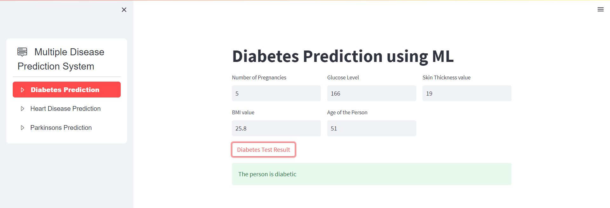
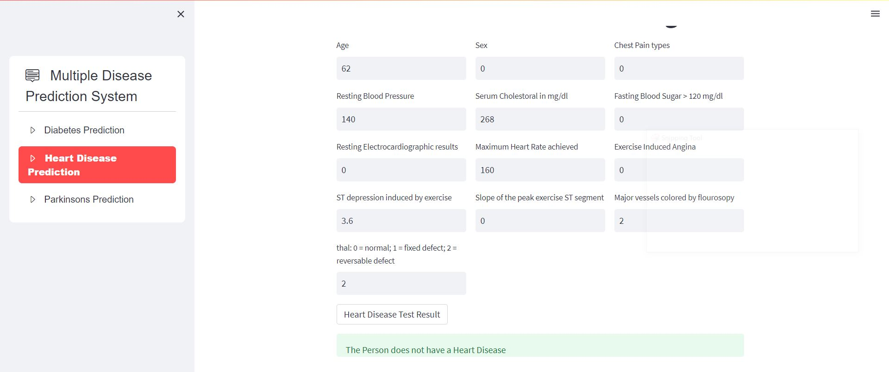
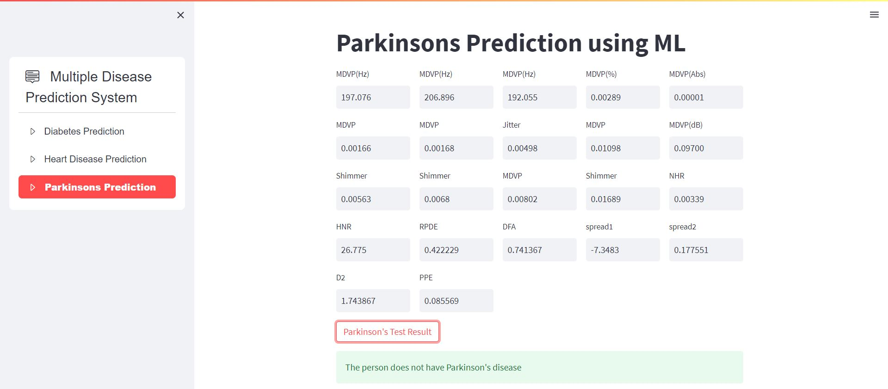

# Multiple-Disease-Prediction

 
    This is a platform where one can check the presence of diseases (Heart, Diagnosis, Parkinsons) by giving input of some essential test in determining those
  diseases. 

<!-- ABOUT THE PROJECT -->
##  About The Project

This project allow users to check presence of three diseases by giving some essential test results. This project is deployed to facilitate user better experience.
  Users can select the disease they want to predict and fill the blanks to get their results. The three diseases in this project are 

- Diabetes 
- Heart Disease
- Parkinsons

##  Screenshots

